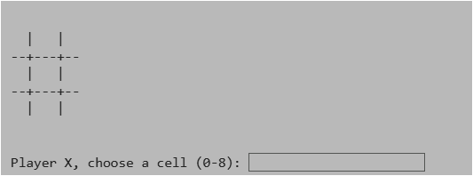

# Tic-Tac-Toe-game-in-Python
A fun, lightweight 3x3 Tic-Tac-Toe game written in Python, playable right in your terminal.

## 🧠 Features
- Two-player mode (X vs O)
- Win/draw detection
- Clean board layout
## Future Scope: Ready for colorful enhancements & AI opponent



## 🚀 How to Play
```bash
python main.py
